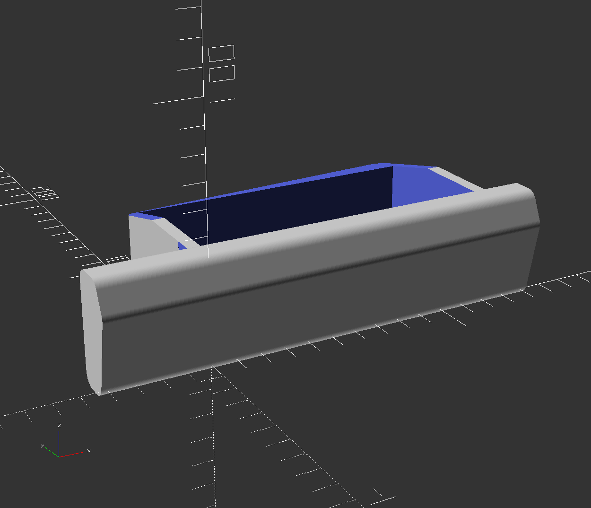
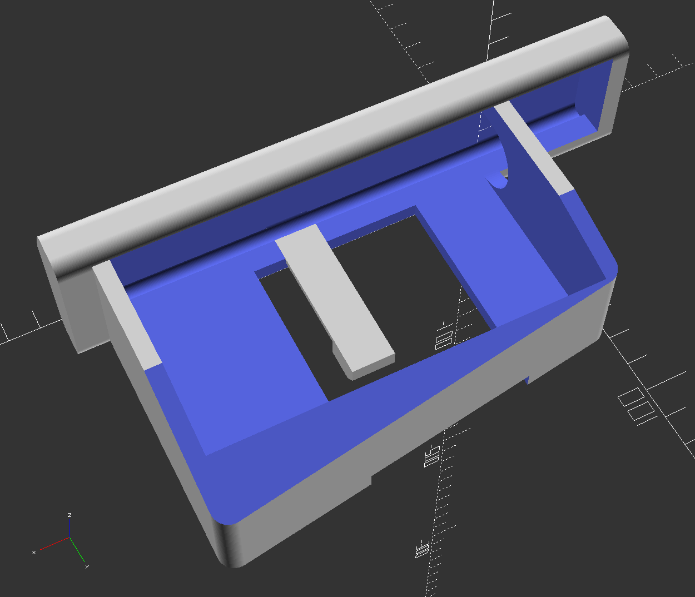
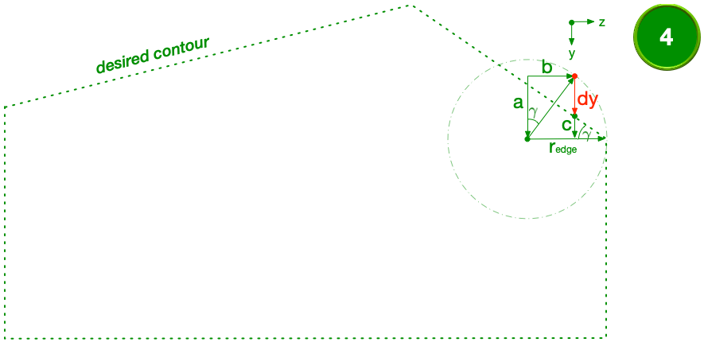

# Car Display Tray #

[[Overview](#overview)] [[Rendering](#rendering)] [[Parameters](#parameters)] [[HowTo - Resize4Rounding](#howToRounding)]

The 3D-model is designed for a BMW 520i from 1990 and integrates a display for a rear view camera by replacing the original drawer for cigarettes. During parking you have to pull the tray that allows you to watch the display for the camera in the back. During driving the display is hidden by pushing it back to the center console of the car.

__< VIDEO TBD >__

Software for cad construction: OpenSCAD 2015.03
- [https://openscad.org](https://openscad.org)
- [https://github.com/openscad/openscad](https://github.com/openscad/openscad)

## Overview ##

Files of the script:

- __carDisplayTray.scad__ includes the module for generating the construction and specifies its parameters

Version history:

| Version | New features                   | Resolved bugs |
| :-----: | :----------------------------- | :------------ |
| v0.2    | -                              | $\circ$ frame x- and z-dimension adapted $\circ$ added bevel for frame |
| v0.1    | first version for initial test | -             |

## Rendering

Result of the rendered script for each version.

v0.2

<table style="background-color:rgba(0, 0, 0, 0);">
	<tr>
		<th>Rendered front view</th>
		<th>... and back view of the tray</th>
	</tr>
	<tr>
		<td></td>
		<td></td>
	</tr>
</table>

v0.1

<table>
	<tr>
		<th>Rendered front view</th>
		<th>... and back view of the tray</th>
	</tr>
	<tr>
		<td></td>
		<td></td>
	</tr>
</table>

## Parameters ##

Description of the used parameters in the script.

| frame | board | slot | hole |
| :---: | :---: | :--: | :--: |
|  |  |  |  |

_Remark: Pictures for illustration of the sections are based on version v0.1_

General parameters

 
<table>
	<tr>
		<th>Name</th>
		<th>Description</th>
	</tr>
	<tr>
		<td>_fn</td>
		<td>Resolution of rounded edges</td>
	</tr>
</table>
 

Parameters for the part 'frame'

 
<table style="background-color:rgba(0, 0, 0, 0);">
	<tr>
		<th>Name</th>
		<th>Description</th>
	</tr>
	<tr>
		<td>fr_dim_x</td>
		<td>x-dimension outer edge</td>
	</tr>
	<tr>
		<td>fr_delta_y</td>
		<td>Additional expansion for display in y-dimension</td>
	</tr>
	<tr>
		<td>fr_dim_y1</td>
		<td>y-dimension outer edge left side</td>
	</tr>
	<tr>
		<td>fr_dim_y2</td>
		<td>y-dimension outer edge right side</td>
	</tr>
	<tr>
		<td>fr_dim_z</td>
		<td>z-dimension outer edge</td>
	</tr>
	<tr>
		<td>fr_edge_r</td>
		<td>Radius of the rounded edges</td>
	</tr>
	<tr>
		<td>fr_bevel_y</td>
		<td>Start-position of the bevel in the back</td>
	</tr>
	<tr>
		<td>fr_bevel_angel</td>
		<td>Angle of the bevel (for slot of BMW)</td>
	</tr>
	<tr>
		<td>fr_display_dim_x</td>
		<td>x-dimension of display</td>
	</tr>
	<tr>
		<td>fr_display_dim_y</td>
		<td>y-dimension of display</td>
	</tr>
	<tr>
		<td>fr_display_delta_z</td>
		<td>Distance display from the bottom</td>
	</tr>
	<tr>
		<td>fr_rail_delta_x</td>
		<td>Additional expansion for rail in x-dimension</td>
	</tr>
	<tr>
		<td>fr_rail_pos_x1</td>
		<td>Left position of rail for locking channel</td>
	</tr>
	<tr>
		<td>fr_rail_pos_x2</td>
		<td>Right position of rail for locking channel</td>
	</tr>
	<tr>
		<td>fr_rail_dim_z</td>
		<td>z-dimension of rail</td>
	</tr>
	<tr>
		<td>fr_feet_dim_x</td>
		<td>x-dimension for feet for display at the side</td>
	</tr>
	<tr>
		<td>fr_feet_dim_z</td>
		<td>z-dimension for feet for display at the side</td>
	</tr>
</table>
 

Parameters for the part 'board'

 
<table>
	<tr>
		<th>Name</th>
		<th>Description</th>
	</tr>
	<tr>
		<td>bd_pos_x1</td>
		<td>Left position in x-dimension</td>
	</tr>
	<tr>
		<td>bd_pos_x2</td>
		<td>Right position in x-dimension</td>
	</tr>
	<tr>
		<td>bd_pt1_pos_y</td>
		<td>Point 1 position in y-dimension</td>
	</tr>
	<tr>
		<td>bd_pt1_pos_z</td>
		<td>Point 1 position in z-dimension</td>
	</tr>
	<tr>
		<td>bd_pt2_pos_y</td>
		<td>Point 2 position in y-dimension</td>
	</tr>
	<tr>
		<td>bd_pt2_pos_z</td>
		<td>Point 2 position in z-dimension</td>
	</tr>
	<tr>
		<td>bd_pt3_pos_y</td>
		<td>Point 3 position in y-dimension</td>
	</tr>
	<tr>
		<td>bd_pt3_pos_z</td>
		<td>Point 3 position in z-dimension</td>
	</tr>
	<tr>
		<td>bd_pt4_pos_y</td>
		<td>Point 4 position in y-dimension</td>
	</tr>
	<tr>
		<td>bd_pt4_pos_z</td>
		<td>Point 4 position in z-dimension</td>
	</tr>
	<tr>
		<td>bd_pt5_pos_y</td>
		<td>Point 5 position in y-dimension</td>
	</tr>
	<tr>
		<td>bd_pt5_pos_z</td>
		<td>Point 5 position in z-dimension</td>
	</tr>
	<tr>
		<td>bd_edge_r</td>
		<td>Radius of the rounded edges</td>
	</tr>
</table>
 

Parameters for the part 'slot'

 
<table>
	<tr>
		<th>Name</th>
		<th>Description</th>
	</tr>
	<tr>
		<td>st_delta_x</td>
		<td>Tolerance for slot in x-dimension</td>
	</tr>
	<tr>
		<td>st_delta_y</td>
		<td>Tolerance for slot in y-dimension</td>
	</tr>
	<tr>
		<td>st_pos_x1</td>
		<td>Left position of slot for fixation in channel</td>
	</tr>
	<tr>
		<td>st_pos_x2</td>
		<td>Right position of slot for fixation in channel</td>
	</tr>
	<tr>
		<td>st_pos_y1</td>
		<td>Front position of slot for fixation in channel</td>
	</tr>
	<tr>
		<td>st_pos_y2</td>
		<td>Back position of slot for fixation in channel</td>
	</tr>
	<tr>
		<td>st_bar_dim_z</td>
		<td>z-dimension of the bar to connect the fixation</td>
	</tr>
</table>
 

Parameters for the part 'hole'

 
<table>
	<tr>
		<th>Name</th>
		<th>Description</th>
	</tr>
	<tr>
		<td>hl_connector_d</td>
		<td>Diameter for hole for connector and wire</td>
	</tr>
	<tr>
		<td>hl_connector_dim_x</td>
		<td>x-dimension for hole cutting off the board</td>
	</tr>
</table>
 

## HowTo - Resize4Rounding ##

The goal is to create a complex shape with rounded edges. Therefore the Minkowski-function is used that rotates a circle around the whole shape. The radius of the circle is then the rounding of the single edges, all done in 2D scope. The problem that has to be solved is that the center of the circle is exactly on the contour of the shape that is responsible for that the resulting shape is larger than the original one.

One way is to use the implemented Resize-function to scale the shape down before or after the use of the Minkowski-function. But for this shape it is not working sufficient. After resizing the shape is distorted a little bit.

To improve the result where the shape keeps its original dimensions the coordinates of every single point has to be adjusted before the use of the Minkowski-function. So the shape is manually scaled down before to get the shape with its desired dimension after the function is executed.

The single steps for trigonometric calculation are explained below.

### Point 1 and 5 ###

For the first points only the radius of the circle has to be added or substituted to the coordinates:

$$\underline{dy = \pm r_{edge}}$$

$$\underline{dz = \pm r_{edge}}$$

### Point 2 and 4 - Calculate delta dy ###

This problem is a little bit more complicated. The example describes the solution for point 4 but it is the same way for point 2, too. In both cases the distance $dy$ is the goal to achieve that is the difference in y-direction that has to be added to the coordinate of the edge. The distance $dz$ is the radius $r_{edge}$ as for point 1 and 5, too.

First the angle $\gamma$ on the right has to be calculated by the adjacent and opposite side of the right triangle:

$$\gamma = atan[(y_{pt4} - y_{pt3}) / (z_{pt4} - z_{pt3})]$$

The red marked point on the circle has to fit the shape. There is a right angle crossing the shape from the center of the circle to that border. Because of the right angle the angle $\gamma$ is between the line to the center and the vertical line, too. By using the angle $\gamma$ the distance $a$ can be calculated as follows:

$$a = cos(\gamma) * r_{edge}$$

Next step is to calculate the distance $b$ on the z-axis to the center point. The subtraction of the radius $r_{edge}$ by the distance $b$ let to the distance
$c$ in the right triangle including the angle $\gamma$:

$$b = sin(\gamma) * r_{edge}$$

$$c = sin(\gamma) * (r_{edge} - b)$$

Now the final value $dy$ can be calculated by the subtraction of the values $a$ and $c$. The distance $dz$ is only the radius for the edge as before:

$$\underline{dy = a - c}$$

$$\underline{dz = \pm r_{edge}}$$

### Point 3 - Calculate delta dy and dz ###

In this case the circle has to be moved in two directions to fit to the shape where no direction is only the radius $r_{edge}$.

To solve this problem the angle $\beta$ has to be calculated. Therefore the already calculated angles $\alpha$ and $\gamma$ are used. The angle $\alpha$ is calculated in the same way as the angle $\gamma$ but for the point 2 instead of point 4 as described in the section above:

$$\beta = 180° - \alpha - \gamma$$

The distance $a$ from the edge of the shape to the center of the circle is calculated by the use of the angle $\beta$:

$$a = r_{edge} / sin(\beta / 2)$$

In the next step the angle $\delta$ is calculated between the line $a$ and the horizontal line or the y-axis illustrated by the distance $dy$:

$$\delta = \gamma + (\beta/2) - 90°$$

The final step is to calculate the delta values $dy$ and $dz$ for both axes with the calculated distance $a$ and the angle $\delta$ before:

$$\underline{dy = cos(\delta) * a}$$

$$\underline{dz = sin(\delta) * a}$$